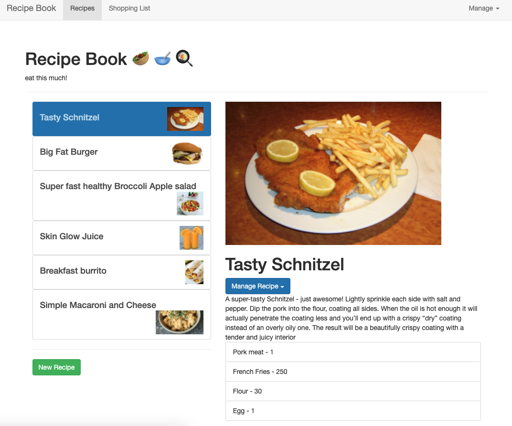
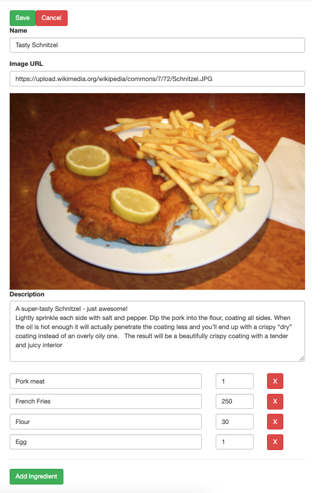
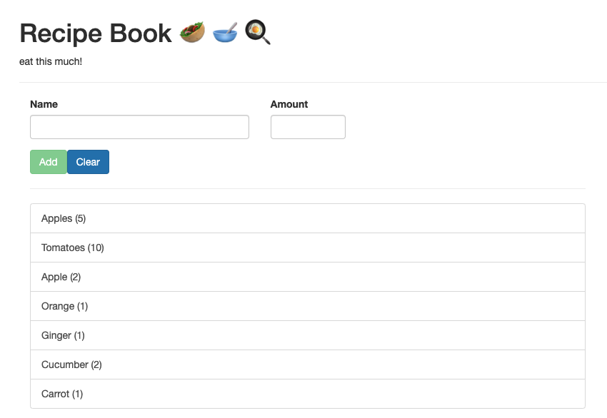

# RecipeBook 🥙 🥣 🍳
> Store & manage your recipes with shopping list.
> Live demo [_here_](https://recipebook-5a83f.web.app/).
> (Fetch data in menu in top right corner)

## Table of Contents
* [General Info](#general-information)
* [Technologies Used](#technologies-used)
* [Screenshots](#screenshots)
* [Setup](#setup)
* [Project Status](#project-status)
* [Room for Improvement](#room-for-improvement)
* [Acknowledgements](#acknowledgements)
* [Contact](#contact)

## General Information
RecipeBook brings you a own space for storage and manage your recipes. You can add photo, keep your recipe instruction and list of ingredients. App gives you an in easy way transfer of ingriedients to shopping list

## Technologies Used
- This project was generated with [Angular CLI](https://github.com/angular/angular-cli) version 11.1.2.
- Using Bootstrap 3
- Firebase hosting and database

## Screenshots
### Main page of application

### Edit form of recipe 

### View of shopping list

## Setup
Run `npm install` to load all necessary dependencies.
Run `ng serve` for a dev server. Navigate to `http://localhost:4200/`. The app will automatically reload if you change any of the source files.
Run `ng build` to build the project. The build artifacts will be stored in the `dist/` directory. Use the `--prod` flag for a production build.

## Project Status
Project is: Done

## Room for Improvement

To do:
- adding up the quantities of the same products

## Acknowledgements

- This project was based on Udemy [this tutorial](https://www.udemy.com/course/the-complete-guide-to-angular-2/) from Maximilian Schwarzmüller.

## Contact
Created by Patryk Król

[Linkedin](https://www.linkedin.com/in/patryk-krol/) or 📧 : patrtyk.krol.98@gmail.com 
